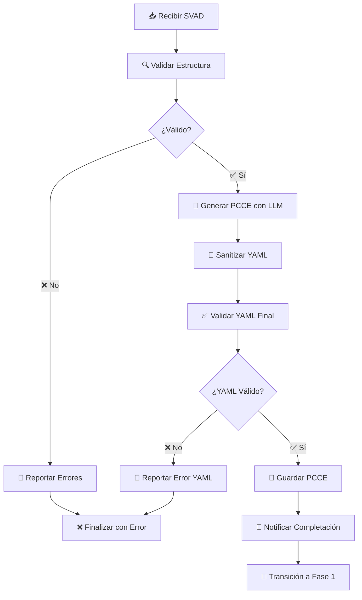

# 📋 RequirementsAgent - Análisis Automático de SVAD

## 🎯 Descripción General

El **RequirementsAgent** es un agente de IA especializado que implementa la **Fase 0 (Análisis de Requerimientos)** de la plataforma DirGen. Su función principal es transformar documentos SVAD (Software Vision and Requirements Document) en especificaciones PCCE (Project Context, Components, and Expectations) válidas y estructuradas.

## ✨ Características Principales

### 🔍 **Validación Robusta de SVAD**
- Verificación automática de estructura contra plantillas estándar
- Detección de secciones faltantes u opcionales
- Puntuación de calidad automática (0-100%)
- Reportes detallados de problemas encontrados

### 🧠 **Generación Inteligente de PCCE**
- Integración con **dirgen_core** para múltiples proveedores LLM
- Fallback automático entre proveedores (Gemini, Local, Groq, OpenAI, etc.)
- Selección óptima de modelo según tipo de tarea
- Generación contextualizada basada en el contenido del SVAD

### 🧹 **Sanitización Avanzada de YAML**
- **Eliminación automática** de cercas de código Markdown (`\`\`\`yaml`)
- **Normalización Unicode** a caracteres ASCII seguros
- **Limpieza de caracteres problemáticos** (BOM, zero-width, smart quotes)
- **Validación YAML** antes del procesamiento
- **Manejo robusto de errores** de parseo

### 🔄 **Integración con Orquestador**
- **Comunicación bidireccional** con el orquestador principal
- **Reporte de progreso en tiempo real** via WebSocket
- **Transición automática** a Fase 1 tras completar PCCE
- **Manejo de errores** con notificación detallada

## 🏗️ Arquitectura

```
RequirementsAgent
├── 📄 requirements_agent.py      # Agente principal
├── 📋 requirements.txt          # Dependencias
├── 📚 README.md                 # Esta documentación
└── 📊 logs/                     # Logs de ejecución
```

### Dependencias Principales
- **dirgen_core**: Servicios centralizados de LLM
- **pyyaml**: Procesamiento de archivos YAML
- **requests**: Comunicación HTTP con orquestador
- **python-dotenv**: Gestión de variables de entorno

## 🚀 Flujo de Trabajo

### **Fase 0: Análisis de Requerimientos**



### **Pasos Detallados:**

1. **📥 Recepción de SVAD**
   - El orquestador invoca el agente con `--svad-path` y `--run-id`
   - Se lee el archivo SVAD con encoding UTF-8

2. **🔍 Validación de Estructura**
   - Verificación contra plantilla estándar de secciones obligatorias:
     - `## 1. Resumen Ejecutivo`
     - `## 2. Actores y Casos de Uso`
     - `## 3. Requerimientos Funcionales (FRs)`
     - `## 4. Requerimientos No Funcionales (NFRs)`
     - `## 6. Visión de la Arquitectura de la Solución`
     - `## 7. Stack Tecnológico Propuesto`
   - Cálculo de puntuación de calidad

3. **🧠 Generación de PCCE**
   - Llamada al servicio LLM con prompt especializado
   - Extracción de información estructurada del SVAD
   - Mapeo automático SVAD → PCCE YAML

4. **🧹 Sanitización de YAML**
   - Eliminación de cercas Markdown (`\`\`\`yaml`)
   - Normalización de caracteres Unicode problemáticos
   - Limpieza de BOM y caracteres invisibles
   - Conversión de tabs a espacios

5. **✅ Validación Final**
   - Parseo con `yaml.safe_load()` para verificar validez
   - Verificación de estructura PCCE esperada

6. **💾 Persistencia**
   - Guardado en archivo temporal con nombre único
   - Notificación al orquestador con ruta del archivo

7. **🔄 Transición Automática**
   - El orquestador inicia automáticamente Fase 1 con el PCCE generado

## 📋 Plantilla SVAD Soportada

### Secciones Obligatorias ✅
- `## 1. Resumen Ejecutivo`
  - `### 1.1 Visión del Producto`
  - `### 1.2 Objetivos de Negocio`
  - `### 1.3 Alcance del Proyecto`
- `## 2. Actores y Casos de Uso`
- `## 3. Requerimientos Funcionales (FRs)`
- `## 4. Requerimientos No Funcionales (NFRs)`
- `## 6. Visión de la Arquitectura de la Solución`
- `## 7. Stack Tecnológico Propuesto`

### Secciones Opcionales ⚠️
- `## 5. Políticas de Gobernanza y Cumplimiento`
- `## 8. Glosario de Términos`

## 🛠️ Uso y Configuración

### Variables de Entorno
```bash
# Configuración de proveedores LLM (heredada de dirgen_core)
export GEMINI_API_KEY="tu-gemini-key"
export GROQ_API_KEY="tu-groq-key"
export OPENAI_API_KEY="tu-openai-key"
# ... otros proveedores

# Configuración de prioridad
export LLM_PRIORITY_ORDER="gemini,local,groq,openai,anthropic,xai"

# URL del orquestrador (por defecto)
export ORCHESTRATOR_HOST="http://127.0.0.1:8000"
```

### Ejecución Manual (Desarrollo)
```bash
cd agents/requirements
python requirements_agent.py --run-id "test-123" --svad-path "../../SVAD_FinBase_v1.md"
```

### Integración con Orquestador (Producción)
El agente es invocado automáticamente por el orquestador cuando se envía un SVAD via:
```bash
POST /v1/initiate_from_svad
```

## 📊 Métricas y Logging

### Logs Estructurados
```
2025-09-17 14:19:32,454 - AGENT(Requirements) - INFO - 🚀 RequirementsAgent iniciado para run-2d45fb3e
2025-09-17 14:19:32,455 - AGENT(Requirements) - INFO - ✅ Archivo SVAD leído: 15,234 caracteres
2025-09-17 14:19:32,456 - AGENT(Requirements) - INFO - ✅ SVAD validado exitosamente. Puntaje de calidad: 100%
2025-09-17 14:19:45,123 - AGENT(Requirements) - INFO - ✅ PCCE generado: 4,726 caracteres
2025-09-17 14:19:45,124 - AGENT(Requirements) - INFO - 🧹 YAML limpiado de cercas de código
2025-09-17 14:19:45,125 - AGENT(Requirements) - INFO - ✅ YAML generado es válido
2025-09-17 14:19:45,200 - AGENT(Requirements) - INFO - ✅ PCCE guardado en: temp/run-2d45fb3e_pcce.yml
2025-09-17 14:19:45,201 - AGENT(Requirements) - INFO - 🎉 RequirementsAgent completado exitosamente
```

### Métricas Disponibles
- **Tiempo de procesamiento**: Desde inicio hasta completación
- **Calidad SVAD**: Puntuación automática 0-100%
- **Tamaño de documentos**: Caracteres SVAD y PCCE generado
- **Uso de LLM**: Provider utilizado y modelo seleccionado
- **Tasa de éxito**: Ratio completación exitosa vs errores

## 🔧 Extensión y Personalización

### Agregar Nueva Plantilla SVAD
1. Modificar `SVAD_TEMPLATE` en `requirements_agent.py`
2. Agregar nuevas secciones obligatorias u opcionales
3. Actualizar la lógica de validación si es necesario

### Personalizar Prompt de Generación
1. Editar `pcce_generation_prompt` en la función `main()`
2. Ajustar instrucciones específicas para el LLM
3. Modificar estructura YAML objetivo si es requerido

### Integrar Nuevos Proveedores LLM
La integración es automática via **dirgen_core**. Solo agregar configuración de API keys.

## ❌ Manejo de Errores

### Errores Comunes y Soluciones

| Error | Causa | Solución |
|-------|-------|----------|
| **SVAD inválido** | Secciones obligatorias faltantes | Completar estructura según plantilla |
| **YAML inválido generado** | LLM generó formato incorrecto | Reintentar o revisar prompt |
| **Archivo no encontrado** | Ruta SVAD incorrecta | Verificar ruta absoluta del archivo |
| **Error de comunicación** | Orquestador no disponible | Verificar que el orquestador esté ejecutándose |
| **LLM no disponible** | Todos los proveedores fallaron | Verificar API keys y conectividad |

### Códigos de Estado
- **✅ success**: PCCE generado correctamente
- **❌ failed**: Error en procesamiento (con razón detallada)

## 🧪 Testing

### Casos de Prueba Recomendados
1. **SVAD completo y válido** → Debe generar PCCE exitosamente
2. **SVAD con secciones faltantes** → Debe reportar error específico
3. **SVAD con encoding problemático** → Debe manejar caracteres especiales
4. **LLM genera YAML con ```** → Debe limpiar automáticamente
5. **Orquestador no disponible** → Debe fallar elegantemente

### Datos de Prueba
- `SVAD_FinBase_v1.md` - Documento gold standard incluido
- Documentos SVAD sintéticos para casos edge

## 🔄 Versionado y Trazabilidad

### Información de Trazabilidad
Cada PCCE generado incluye metadatos:
```yaml
trazabilidad:
  requerido: true
  campos: ["run_id", "agent_id", "prompt_version", "artifact_hash", "timestamp"]
```

### Historial de Versiones
- **v1.0**: Implementación inicial con sanitización YAML
- **v1.1**: Integración con dirgen_core
- **v1.2**: Mejoras en manejo de errores y logging

---

## 📞 Soporte

Para problemas específicos del RequirementsAgent:
1. **Revisar logs** en `agents/requirements/logs/`
2. **Verificar configuración** de variables de entorno LLM
3. **Validar SVAD** contra plantilla estándar
4. **Reportar issues** con logs detallados y SVAD problemático

---

**🚀 RequirementsAgent - Transformando requerimientos en especificaciones técnicas con IA avanzada**

*Desarrollado como parte de DirGen Platform v2.0 | Estado: ✅ PRODUCTION READY*